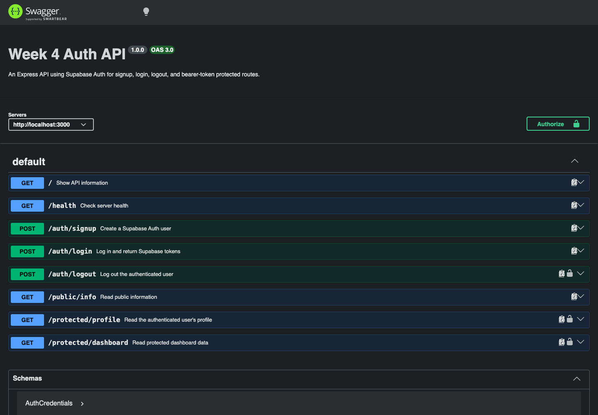

# Week 4 - Auth API with Supabase

This project is an Express API that uses Supabase Auth for signup, login, logout, and bearer-token protected routes.

The backend never stores passwords and never hashes passwords itself. Supabase manages users, password hashing, and JWT issuing. This API verifies access tokens before allowing protected routes to run.

## Setup

Create a Supabase project, then copy the project URL and publishable key from Supabase Dashboard -> Project Settings -> API.

Turn off email confirmation for this practice assignment:

```text
Authentication -> Sign In / Providers -> Email -> Confirm email: off
```

If signup returns `201` but login still returns `401`, email confirmation is probably still enabled in Supabase. Turn it off, create a new test user, then log in again.

Create your local environment file:

```bash
cp .env.example .env
```

Fill in `.env`:

```env
SUPABASE_URL=https://your-project-ref.supabase.co
SUPABASE_PUBLISHABLE_KEY=your_supabase_publishable_or_anon_key
PORT=3000
```

`.env` is gitignored. Do not commit real Supabase keys.

## Run

From this folder:

```bash
npm install
npm start
```

The API runs at:

```text
http://localhost:3000
```

Swagger UI runs at:

```text
http://localhost:3000/docs
```

## Endpoints

| Method | Path | Auth required | What it does | Success |
| --- | --- | --- | --- | --- |
| GET | `/` | No | Shows API name, version, and endpoints | `200` |
| GET | `/health` | No | Checks server health | `200` |
| POST | `/auth/signup` | No | Creates a Supabase Auth user | `201` |
| POST | `/auth/login` | No | Logs in and returns access/refresh tokens | `200` |
| POST | `/auth/logout` | Yes | Logs out an authenticated user | `204` |
| GET | `/public/info` | No | Returns public information | `200` |
| GET | `/protected/profile` | Yes | Returns safe current-user metadata | `200` |
| GET | `/protected/dashboard` | Yes | Proves the reusable auth middleware protects another route | `200` |

Invalid signup/login bodies return `400`. Missing, malformed, invalid, or expired bearer tokens return `401` with a JSON error.

## Test with curl

Sign up:

```bash
curl -i -X POST http://localhost:3000/auth/signup \
  -H "Content-Type: application/json" \
  -d '{"email":"test@example.com","password":"password123"}'
```

Log in:

```bash
curl -i -X POST http://localhost:3000/auth/login \
  -H "Content-Type: application/json" \
  -d '{"email":"test@example.com","password":"password123"}'
```

Save the returned access token:

```bash
TOKEN="paste_access_token_here"
```

Call a protected route:

```bash
curl -i http://localhost:3000/protected/profile \
  -H "Authorization: Bearer $TOKEN"
```

Tamper with one character of the token and run the same command again. The API returns `401`:

```json
{ "error": "Invalid or expired token" }
```

Logout:

```bash
curl -i -X POST http://localhost:3000/auth/logout \
  -H "Authorization: Bearer $TOKEN"
```

## Example curl output

```bash
curl -i http://127.0.0.1:3000/protected/profile
```

```http
HTTP/1.1 401 Unauthorized
X-Powered-By: Express
Content-Type: application/json; charset=utf-8
Content-Length: 33

{"error":"Access token required"}
```

## Swagger UI

Swagger UI documents every endpoint and uses a bearer JWT security scheme. Click `Authorize`, paste the access token from `/auth/login`, then run `Try it out` on `/protected/profile` or `/protected/dashboard`.



## Architecture

Auth protection is handled by reusable middleware in `src/middleware/requireAuth.js`.

The middleware:

- extracts `Authorization: Bearer <token>`
- verifies the JWT with `supabase.auth.getUser(token)`
- returns `401` for missing, malformed, expired, or invalid tokens
- attaches safe user metadata to `req.user`

`/protected/profile`, `/protected/dashboard`, and `/auth/logout` all use the same middleware, so protected routes do not copy-paste token verification logic.

## Security Notes

This project uses the Supabase anon key, not the `service_role` key. The `service_role` key bypasses security rules and must never be committed or exposed.

The API does not store passwords. Supabase Auth handles account storage, password hashing, login, JWT issuing, and token verification.
