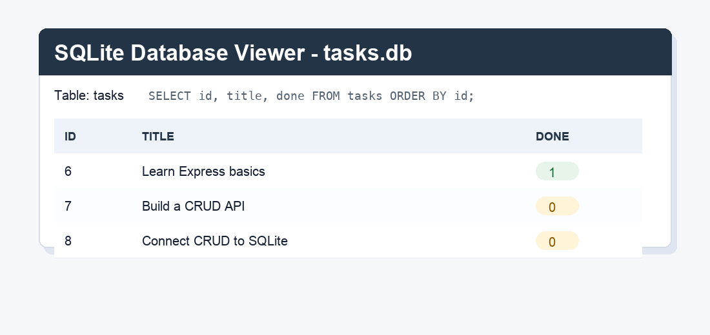

# Week 3 - Task API with SQLite

This is the Week 2 CRUD Task API connected to a real SQLite database instead of an in-memory array. The API endpoints behave the same, but tasks now survive server restarts.

## Why SQLite

SQLite was chosen because it stores data in one local file and does not need a separate database server. That keeps this assignment focused on SQL and persistence instead of database installation.

## Run

From this folder:

```bash
npm install
npm start
```

The API runs at `http://localhost:3000`.

Swagger UI runs at `http://localhost:3000/docs`.

## Database File

The database file is created automatically at:

```text
tasks.db
```

The file is gitignored because it is generated local data. If `tasks.db` is missing, the app creates it, creates the `tasks` table, and inserts three example tasks only when the table is empty.

## Endpoints

| Method | Path | What it does | Success |
| --- | --- | --- | --- |
| GET | `/` | Shows API name, version, and endpoints | `200` |
| GET | `/health` | Shows server health | `200` |
| GET | `/tasks` | Lists all tasks from SQLite | `200` |
| GET | `/tasks/:id` | Gets one task by ID | `200` |
| POST | `/tasks` | Creates a task from `{ "title": "..." }` | `201` |
| PUT | `/tasks/:id` | Updates `title` and/or `done` | `200` |
| DELETE | `/tasks/:id` | Deletes one task | `204` |

Invalid bodies return `400`. Unknown task IDs return `404`. Error responses use JSON, for example `{ "error": "Task 99 not found" }`.

## Example curl output

```bash
curl -i http://localhost:3000/tasks
```

```http
HTTP/1.1 200 OK
Content-Type: application/json; charset=utf-8

[{"id":1,"title":"Learn Express basics","done":true},{"id":2,"title":"Build a CRUD API","done":false},{"id":3,"title":"Connect CRUD to SQLite","done":false}]
```

## Example SQL Query

```sql
SELECT * FROM tasks WHERE done = 1;
```

More Stage 4 SQL exploration notes are in `SQL_EXPLORATION.md`.

## Database Screenshot



## Persistence Proof

I created a row through the API:

```text
POST /tasks
201 {"id":4,"title":"Survives restart","done":false}
```

Then I stopped and restarted the server. After restart, `GET /tasks` still included:

```text
{"id":4,"title":"Survives restart","done":false}
```

That proves the tasks are stored in SQLite, not in app memory.

## Architecture Note

Storage is behind a repository layer:

- `src/routes/taskRoutes.js` handles HTTP requests and responses.
- `src/services/taskService.js` owns validation and task rules.
- `src/repositories/sqliteTaskRepository.js` owns all SQL queries.

The SQLite repository replaced the in-memory store. The route and service code keep the same API behavior while the storage implementation changes behind the repository.
