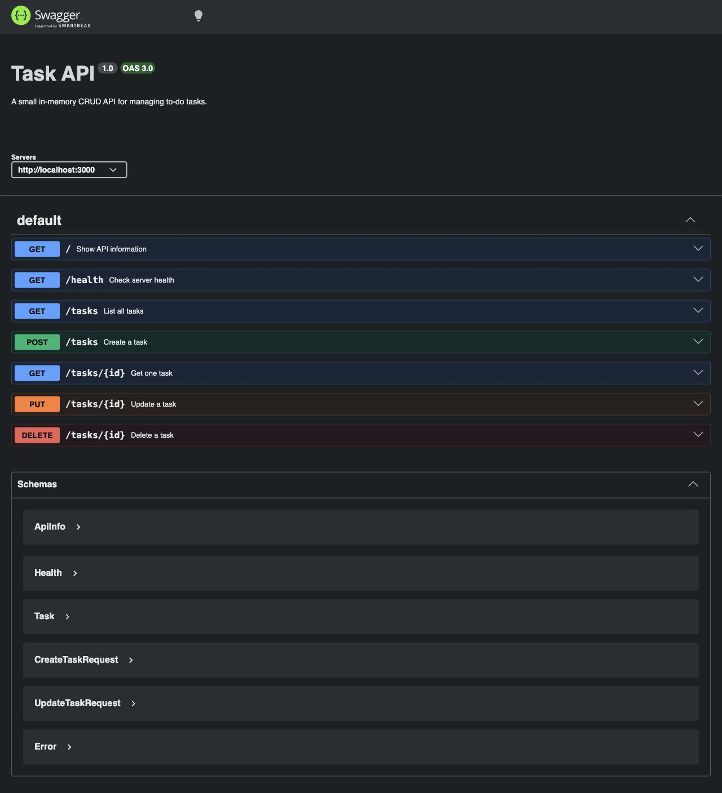

# Week 2 - Task API

A small Express API for managing an in-memory to-do list. It supports the full CRUD cycle: create, read, update, and delete tasks.

## Run

From this folder:

```bash
npm install && npm start
```

The server runs at `http://localhost:3000`.

Swagger UI is available at `http://localhost:3000/docs`.

## Endpoints

| Method | Path | What it does | Success |
| --- | --- | --- | --- |
| GET | `/` | Shows API name, version, and endpoints | `200` |
| GET | `/health` | Shows server health | `200` |
| GET | `/tasks` | Lists all tasks | `200` |
| GET | `/tasks/:id` | Gets one task by ID | `200` |
| POST | `/tasks` | Creates a task from `{ "title": "..." }` | `201` |
| PUT | `/tasks/:id` | Updates `title` and/or `done` | `200` |
| DELETE | `/tasks/:id` | Deletes one task | `204` |

Errors return JSON like `{ "error": "Task 99 not found" }`.

## Example curl output

```bash
curl -i http://localhost:3000/tasks/1
```

```http
HTTP/1.1 200 OK
X-Powered-By: Express
Content-Type: application/json; charset=utf-8
Content-Length: 51

{"id":1,"title":"Learn Express basics","done":true}
```

## Swagger UI

The full CRUD cycle was tested through Swagger UI:

- `POST /tasks` returned `201`
- `PUT /tasks/{id}` returned `200`
- `DELETE /tasks/{id}` returned `204`



## Storage note

Tasks are stored in memory only. If the server restarts, the list goes back to the three example tasks because there is no database yet.
